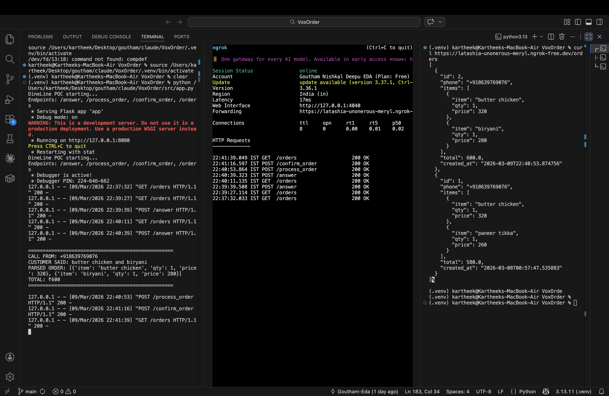

# VoxOrder 🎙️

**AI-Powered Phone Ordering System for Restaurants**

VoxOrder accepts incoming phone calls on a restaurant's existing number, processes orders through natural language conversation, and saves them to a database — operating 24/7 without human staff.

[](https://python.org)
[](https://flask.palletsprojects.com)
[](https://twilio.com)
[](LICENSE)
[]()

---

## 🚀 Live Demo

**Real call → Real speech → Real parsed order → Real database record**



**Test call 1:**
```
CALL FROM: +918639769076
CUSTOMER SAID: I want a butter chicken and one garlic naan.
PARSED ORDER: [{'item': 'butter chicken', 'qty': 1, 'price': 320},
               {'item': 'garlic naan',    'qty': 1, 'price': 60}]
TOTAL: ₹380
```

**Test call 2:**
```
CALL FROM: +918639769076
CUSTOMER SAID: butter chicken and biryani
PARSED ORDER: [{'item': 'butter chicken', 'qty': 1, 'price': 320},
               {'item': 'biryani',        'qty': 1, 'price': 280}]
TOTAL: ₹600
```

**Database output:**
```json
{
  "id": 2,
  "phone": "+918639769076",
  "items": [
    {"item": "butter chicken", "qty": 1, "price": 320},
    {"item": "biryani",        "qty": 1, "price": 280}
  ],
  "total": 600.0,
  "created_at": "2026-03-09T22:40:53.874756"
}
```

---

## 📣 Community Response

VoxOrder's first demo post received **2,278 impressions** and validated the core problem — restaurant industry professionals confirmed missed calls during dinner rush is a real, unsolved revenue problem for small restaurants.

---

## 📋 What It Does

| Step | What Happens |
|------|-------------|
| 1️⃣ | Customer calls the restaurant's Twilio number |
| 2️⃣ | VoxOrder greets the caller and asks for their order |
| 3️⃣ | Speech recognition converts voice to text in real time |
| 4️⃣ | NLU engine extracts items and quantities from natural language |
| 5️⃣ | System reads back the order with total price for confirmation |
| 6️⃣ | Confirmed order is saved to database |

---

## 🛠️ Tech Stack

| Layer | Technology |
|-------|-----------|
| Language | Python 3.9+ |
| Web Framework | Flask |
| Telephony | Twilio (Voice + Speech Recognition) |
| NLU | spaCy + custom parser |
| Database | SQLite (POC) → PostgreSQL (MVP) |
| Tunnel | ngrok / serveo.net |

---

## ⚡ Quick Start

### Prerequisites
- Python 3.9+
- Twilio account with a phone number (~$1/month)
- ngrok (with authtoken) or serveo.net

### Installation

```bash
# Clone the repo
git clone https://github.com/Goutham-Eda/VoxOrder.git
cd VoxOrder

# Create virtual environment
python3 -m venv .venv
source .venv/bin/activate  # Windows: .venv\Scripts\activate

# Install dependencies
pip install -r requirements.txt
python -m spacy download en_core_web_sm
```

### Configuration

Create a `.env` file in the project root:

```bash
TWILIO_ACCOUNT_SID=ACxxxxxxxxxxxxxxxxxxxxxxxxxxxxxx
TWILIO_AUTH_TOKEN=your_auth_token_here
TWILIO_PHONE_NUMBER=+1234567890
```

### Run

```bash
# Terminal 1 — Start the server
python src/app.py

# Terminal 2 — Expose to internet (pick one)
ngrok http 8080
# OR
ssh -R 80:localhost:8080 serveo.net
```

### Configure Twilio Webhook

In your [Twilio Console](https://console.twilio.com):
1. Go to **Phone Numbers → Active Numbers → Your Number**
2. Under **Voice Configuration**, set webhook to:
   ```
   https://YOUR-TUNNEL-URL/answer
   ```
3. Set method to **HTTP POST** → Save

### Make a Test Call

Call your Twilio number and say:
> *"I want two butter chickens and one garlic naan"*

Watch your terminal parse it in real time.

---

## 📁 Project Structure

```
VoxOrder/
├── src/
│   └── app.py              # Main Flask application
├── docs/
│   └── demo_screenshot.png # Live demo terminal output
├── requirements.txt        # Python dependencies
├── .env.example            # Environment variable template
├── .gitignore
├── LICENSE
└── README.md
```

---

## 🍽️ Default Menu

The POC ships with a sample Indian restaurant menu:

| Item | Price (₹) |
|------|----------|
| Butter Chicken | 320 |
| Biryani | 280 |
| Paneer Tikka | 260 |
| Dal Makhani | 220 |
| Chicken Tikka | 300 |
| Garlic Naan | 60 |
| Rice | 80 |
| Lassi | 90 |
| Gulab Jamun | 120 |

To customise the menu, edit the `MENU` dictionary in `src/app.py`.

---

## 🔌 API Endpoints

| Method | Endpoint | Description |
|--------|----------|-------------|
| POST | `/answer` | Twilio incoming call webhook — greets caller |
| POST | `/process_order` | Handles speech input, parses order |
| POST | `/confirm_order` | Handles yes/no confirmation from caller |
| GET | `/orders` | Returns all saved orders as JSON |

---

## 🗺️ Roadmap

### ✅ POC (Complete)
- [x] Inbound call handling via Twilio
- [x] Speech-to-text via Twilio `<Gather>`
- [x] NLU — item and quantity extraction
- [x] Order confirmation flow
- [x] SQLite persistence
- [x] End-to-end demo with real calls
- [x] 2,278 LinkedIn impressions — problem validated

### 🔄 MVP (In Progress)
- [ ] Google Cloud Speech-to-Text — better accuracy, Indian accent support
- [ ] Sarvam AI — Hindi/Telugu language support
- [ ] PostgreSQL — production database
- [ ] Multi-item quantity parsing improvements
- [ ] FastAPI migration
- [ ] Docker containerisation
- [ ] POS integration (Square / Toast)
- [ ] Admin dashboard

### 🔮 Full Product
- [ ] Multi-language support (7 languages)
- [ ] Intelligent upselling
- [ ] Fraud detection
- [ ] Human handoff
- [ ] 1000+ concurrent calls via Kubernetes
- [ ] Analytics and reporting

---

## ⚠️ Known Limitations (POC)

- Handles one call at a time (no concurrency)
- English only — Hindi/Telugu support planned via Sarvam AI
- Basic fuzzy matching — uncommon phrasings may not parse
- No payment processing (COD assumed)
- Twilio trial account requires verified caller numbers
- ngrok free tier shows 403 without authtoken — add yours via `ngrok config add-authtoken YOUR_TOKEN`
- **macOS users:** port 5000 is reserved by AirPlay receiver. App runs on port 8080 by default to avoid this conflict.

---

## 🤝 Contributing

This project is in active development. Issues and PRs welcome.

1. Fork the repo
2. Create a feature branch: `git checkout -b feat/your-feature`
3. Commit: `git commit -m "feat: description"`
4. Push and open a PR

---

## 📄 License

MIT License — see [LICENSE](LICENSE) for details.

---

## 👤 Author

**Goutham Nishkal Deepu Eda**
- LinkedIn: [linkedin.com/in/goutham-nishkal](https://linkedin.com/in/goutham-nishkal)
- GitHub: [github.com/Goutham-Eda](https://github.com/Goutham-Eda)

---

*Built to replace missed calls and lost orders with always-on AI.*